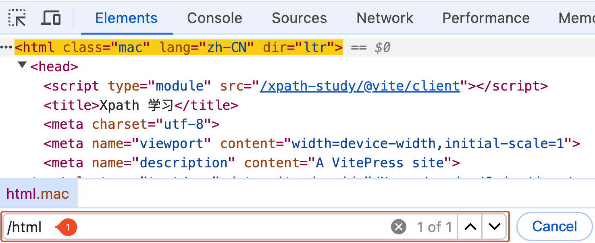

# Xpath 学习

XPath 即为 [XML](https://zh.wikipedia.org/wiki/XML) 路径语言（XML Path Language），它是一种用来确定 XML 文档中某部分位置的语言。

## XPath 的优点和用途

- 简单易用

   XPath 语法简洁明了，易于学习和使用。

- 灵活性高

   可以通过简单的路径表达式选择 XML 文档中的几乎任何部分。

- 强大的查询功能

   支持复杂的查询，包括条件筛选、节点关系（如祖先、兄弟等）以及排序和分组等功能。

- 平台兼容性

   是 W3C 的标准，广泛支持，跨平台兼容性强。

- 与其他技术集成良好

   XPath 是 XSLT、XQuery 和 XPointer 等技术的基础，可以与这些技术无缝集成。

- 支持命名空间

   可以处理 XML 命名空间，适用于复杂的 XML 文档。

## XPath 编写和测试

在编写和测试 XPath 表达式时，可以使用各种工具和库，如 DevTools 、浏览器插件等。

### 安装浏览器插件

在 Chrome 浏览器中，可以使用 XPath Helper 插件来编写和测试 XPath 表达式。

在 Firefox 浏览器中，可以使用 Try Xpath 插件来编写和测试 XPath 表达式。

### 浏览器开发者工具

在浏览器中，可以使用开发者工具（如 Chrome 的 DevTools）来编写和测试 XPath 表达式。

1. 打开开发者工具，通常可以通过右键点击页面元素，然后选择“检查”或“检查元素”来打开。
2. 在“元素”面板中，可以查看和编辑 HTML 源代码。
3. 使用快捷键 `Command + F` 可以在搜索框中输入 XPath 表达式来选择元素

或者在控制台选择 `Console` 中输入 `$x('path')` 来测试 Xpath 表达式。

